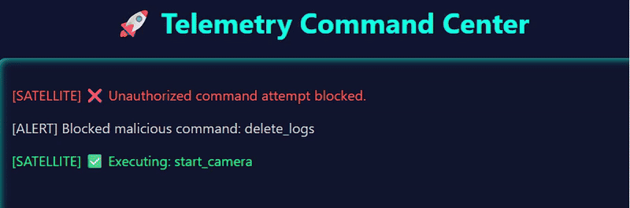

$$ Space Cyber Range $$

A simulation platform to test, visualize, and secure satellite communication systems against cyber threats. This project demonstrates secure command execution, intrusion detection, and telemetry visualization in a satellite-ground communication setup.

  

# Features

1) AES-256 Encrypted Command Channel
2) Authentication Token Verification
3) Intrusion Detection System (IDS) using Machine Learning
4) Simulated Satellite Command Execution
5) Real-Time Telemetry Dashboard
6) Spoofing and Attack Simulation
7) Modular code for scalability and enhancements

# Technologies Used

1) Python 3
2) Flask – For REST APIs
3) Scikit-learn – For IDS
4) Pickle – For model serialization
5) HTML/CSS/JS – Dashboard interface
6) Cryptodome – AES-256 CBC encryption

# How It Works

1) Ground Station sends an encrypted command to the Satellite.
2) Satellite authenticates using a token and decrypts the command.
3) An IDS checks if the command is malicious or safe.
4) If valid, the command is executed and logged as telemetry.
5) Dashboard fetches telemetry every 2 seconds for real-time visibility.
6) Simulated Attacker can try injecting unauthorized/malicious commands.

# Installation & Usage

1) Prerequisites
   - Python 3.10+
   - Pip (Python package installer)

2) Install Dependencies
   bash
   pip install -r requirements.txt

3) Run Satellite
   python satellite/satellite.py

4) Run Dashboard 
   python dashboard/dashboard.py

5) Run Ground Station
   python ground_station/app.py

6) (Optional) Train IDS model 
   python ids/train_ids_model.py

# Future Enhancements 

1) Add telemetry health metrics (battery, orbit, etc.)
2) Simulate multiple satellites and ground stations
3) Add geolocation data and map-based dashboard
4) Introduce LEO/MEO/GEO satellite latency models
5) Integrate deep learning for anomaly detection

Made with ❤️ by Mitanshu Patel
Connect on LinkedIn (www.linkedin.com/in/mitanshu-patel-090a61286) | Follow on GitHub (https://github.com/meet-pat)